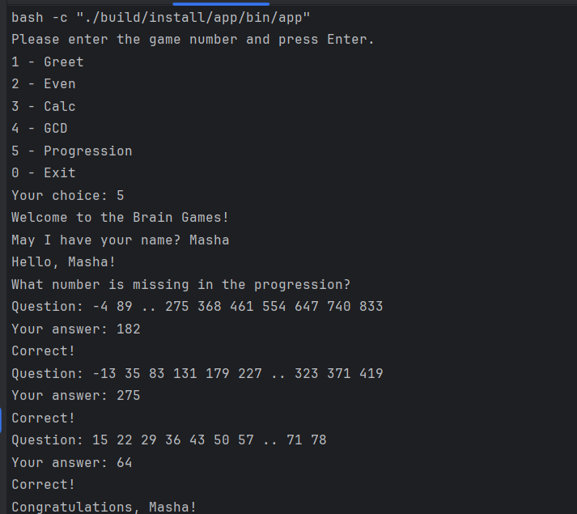

### Hexlet tests and linter status:
[](https://github.com/Jora777F/java-project-61/actions)
[](https://sonarcloud.io/summary/new_code?id=Jora777F_java-project-61)
[](https://sonarcloud.io/summary/new_code?id=Jora777F_java-project-61)
[](https://sonarcloud.io/summary/new_code?id=Jora777F_java-project-61)

---
### 📖 Описание проекта
**Проект "Игры разума"** - это набор из пяти консольных игр, построенных по принципу популярных приложений для прокачки мозгов.  
В каждой игре задаются математические вопросы, на которые Вы должны дать правильные ответы. После трех правильных ответов игра считается завершенной. Неправильные ответы завершают игру и предлагают Вам пройти ее еще раз.

Проект включает:
+ Определение четного числа.
+ Вычисление арифметических выражений.
+ Определение наибольшего общего делителя.
+ Поиск пропущенных чисел в арифметической прогрессии.
+ Определение простого числа.
---

### 🚀 Запуск приложения
```bash
make run-dist
```
---

### 🎮 Игры
Чтобы убедиться в том, что все действительно работает, были записаны [аскинемы](https://asciinema.org/), а также сделаны скриншоты.

#### Игра "Проверка на четность"
[Even Game](app/assets/game.cast)

#### Игра "Калькулятор"
[Calculator Game](app/assets/calculator.cast)

#### Игра "НОД"
[Greatest Common Divisor](app/assets/gcd.cast)

#### Игра "Арифметическая прогрессия"


#### Игра "Простое число"

